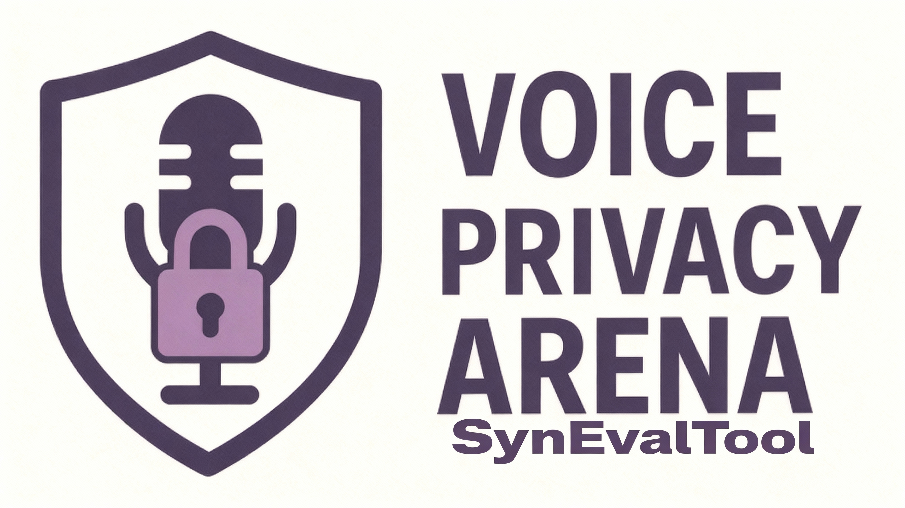

<!--  -->

<!-- 

  
  
   
  
   -->

<!-- 
 -->

<!-- # SynEvalArena

Following our release of the (Voice Privacy Arena)[https://github.com/Speech-Arena/SynEvalArena#] leaderboard, Speech Arena Team presents accompanying SynEvalArena toolkit to evaluate your own systems. 
 

# Overview
Tradidional evaluation of voice anonymization systems focuses on metrics like EER (Equal Error Rate) and WER (Word Error Rate). In additon to these standard metrcis, the toolkit offers a suite of many others for robust evaluation of VA systems.

This reporistroy contains two main toolkit directories - 
- `synthetic_speech_eval` - Metrics for evaluation of synthetic speech generated by modern end to end voice anonymization and voice conversion systems. Check out the [Readme](./ss/Readme.md) for more details. 
- `voice_privacy_eval` - We propose two new metrcis - AUDI (Audio Utility Distortion Index) and Fusion EER to evaluate the utility and privacy of voice anonymization systems. Check the [Readme](./vp/Readme.md) for more details. 

 --> 

 
 

  
  
   
  
   

# 🎙️ SynEvalArena

Following our release of the [**Voice Privacy Arena**](https://github.com/Speech-Arena/SynEvalArena#) 🏆 leaderboard, the **Speech Arena Team** proudly presents the accompanying **SynEvalArena Toolkit** to help you evaluate your own systems with ease.  

---

# 🧭 Overview

Traditional evaluation of voice anonymization systems focuses mainly on metrics such as **EER (Equal Error Rate)** and **WER (Word Error Rate)**.  
In addition to these, the toolkit provides a broader suite of metrics ⚙️ for robust, multi-dimensional evaluation of **Voice Anonymization (VA)** systems.

This repository contains two main toolkit directories 📁:

- 🧬 **`synthetic_speech_eval`** – Metrics for evaluating *synthetic speech* generated by modern end-to-end voice anonymization and voice conversion systems.  
  📘 See the [Readme](./synthetic_speech_eval/README.md) for detailed usage.

- 🔐 **`voice_privacy_eval`** – Introduces two new metrics:  
  **AUDI (Audio Utility Distortion Index)** and **Fusion EER**, designed measure **utility** and **privacy** by using multiple reference systems for robust evaluation.  
  📘 Refer to the [Readme](./voice_privacy_eval/README.md) for more details.

---

